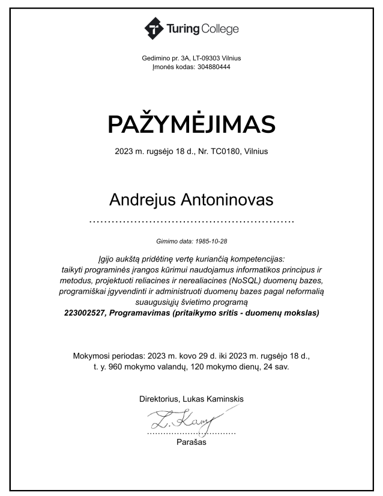

# Išsilavinimas susijęs su dabartiniais karjeros tiksliais

# Andrejus Antoninovas
Programuotojas
| [andrejusantoninovas@gmail.com](mailto:andrejusantoninovas@gmail.com)
| 060127197
| [https://andrejusanto.github.io/programuok/](https://andrejusanto.github.io/programuok/)
| [linkedin.com/in/andrejus-antoninovas](https://www.linkedin.com/in/andrejus-antoninovas-58a802b6/)

## Python:
- [Turing-projektai](https://github.com/AndrejusAnto/Turing-projektai) (Jupyter Notebook)
- [aliobutai](https://github.com/AndrejusAnto/aliobutai) (Jupyter Notebook)
- [bestcalc](https://github.com/AndrejusAnto/bestcalc) (Python)
- [CA-BigData-](https://github.com/AndrejusAnto/CA-BigData-) (Jupyter Notebook)
- [CA-Python](https://github.com/AndrejusAnto/CA-Python) (Jupyter Notebook)
- [tvwatch](https://github.com/AndrejusAnto/tvwatch) (Python)
- [versadauzduotis](https://github.com/AndrejusAnto/versadauzduotis) (Python)
- [zintistyrimas](https://github.com/AndrejusAnto/zintistyrimas) (Python)

## C:
- [Cprograming](https://github.com/AndrejusAnto/Cprograming) (C)

**Sugebėjimai:**
  
  * Pramokęs programuoti su Python'u
  
  * Moku instaliuoti (naudoti) Linux'us, Windows'us ir programas, kaip pagrindinė operacinę sistemą naudoju Linux'us
  
  * Nebijau komandinės eilutės
  
  * Moku dirbit su daugeliu office tipo programom ir pan.
  
*Susipažinęs:*
  
  * Python bibliotekomis: pandas, numpy, bokeh.
  
  * Bash/shell script'inimu https://github.com/Orasporas/Blender-3D-stuff/blob/master/blenderdocker.sh
  
  * Virtualenv (conda) ir virtualizacijos programomis (Gnome Boxes, VirtualBox ir pan.)
  
  * Webscraping'imu https://github.com/Orasporas/aliobutai/blob/master/aliobutai.py
  
  * Docker https://github.com/Orasporas/Blender-3D-stuff/blob/master/blenderdocker.sh
  
  * Machine Learning (Scikit-learn, Keras (TensorFlow))
  
  * Sql duomenų basėmis (https://github.com/Orasporas/aliobutai/blob/master/sqlaliobutai.ipynb)
  
  * Su kompiuterinėmis dalimis, pagrindines galiu atpažinti, bet neesu sudėjęs kompiuterio.
  
  * Blender'iu (3D programa https://www.youtube.com/watch?v=BQ9vbdqxeQk&list=PL0EQUv65iMdyg8GHlblAYAB5F0RSHXXMH)
  
  * Video redagavimu (Blender)
  
  * Gimp'u redaguojant nuotraukas
  
  * Dabar mokausi C programavimo kalbą (išspręstus challengus galima pasižiūrėti čia https://www.hackerrank.com/andrejusantonin1?hr_r=1)

**Savybės:**
  
  cv.lt asmeninių gebėjimų testas teigia, kad gabumus lemia šie intelekto tipai:
  
  Vidinis - 19.7%, Natūralistinis - 14.5%, Verbalinis - 13.7%, Loginis/matematinis - 12.8%, Tarpasmeninis - 12.0%, Kinestezinis - 12.0%, Erdvinis - 9.4%, Muzikinis - 6.0%
  
  Vidinis intelektas – tai gabumas pažinti save, paaiškinti savo ir kitų žmonių mintis, jausmus, emocijas, nusipiešti tikslų savo psichologinį portretą, ieškoti atsakymų į būties klausimus. Žmogus, kurio vidinis intelektas dominuoja, yra jautrus savo vertybėms, gerai pažįsta savo jausmus, pranašumus, trūkumus, puikiai suvokia savo tikslą, turi intuiciją, vidinę motyvaciją. Vidinio intelekto žmonės yra linkę į savianalizę ir individualizmą, jiems nesvetimas uždarumas. Kartais kitų jie yra vertinami kaip keistoki.
  
  Natūralistinis intelektas pasireiškia kaip pagarbi ir tausojanti meilė gamtai, gebėjimas ją stebėti, ja rūpintis, ją globoti. Tai – šiuolaikinio žmogaus neprarastojo ryšio su žeme, gyvybės ciklais ir biologiniais ritmais apraiška.
  
  cv.lt karjeros interesų testo rezultatai:
  
  Socialinis tipas ypač vertina paslaugas kitiems, teisingumą, supratimą, betarpiškumą. Save suvokia kaip draugišką, patikimą ir padedantį kitiems, gailestingą, dosnų, nuoširdų. Ką nors darydamas visada atsižvelgia į aplinkinių žmonių nuomones, stengiasi rasti visus tenkinantį sprendimą. Jam patinka dirbti su grupe, jis linkęs asmeniškai aukotis, kad įvykdytų grupės uždavinius. Siekdamas sutarimo, kartais nepaiso darbo efektyvumo. Per daug domisi smulkmenomis ir kitų nuomone.
  
  Tyrinėtojo tipas vertina pasitikėjimą savimi, nepriklausomus, originalius sprendimus, gilias teorines žinias, gerą išsilavinimą. Save suvokia kaip protingą, smalsų, logišką, tikslų, analitišką, santūrų. Pirmumą teikia protiniam, moksliniam darbui, siekdamas pažinti materialaus, socialinio ar dvasinio pasaulio raidą. Mėgsta dirbti savarankiškai, analizuoti problemas, priežastis, duomenis, vertinti galimybes, numatyti veikimo planą, daryti išvadas, priimti sprendimus. Kartais gali susitelkti ties detalėmis ir nematyti visumos. Gali iškelti daug klausimų, pateikti daug smulkmenų ir neišdėstyti esmės.
  
  
**Kalbos:**
   
  * Lietuvių
  
  * Anglų - suprantu, bet neturiu daug patirties kalbant arba rašant.

**Pagrindinis išsilavinimas:**

  Vytauto Didžiojo Universietas (2004 - 2008) - Ekonomistas (bakalauras)

**Darbo patirtis:**

Universiteto laikais kelios vasaros pagalbiniu darbininku Senukų sandėliuose, taip pat apie mėn. kauno kooperacijos didmeninės prekybos sandėlyje.

UAB INIT Abonentų apskaitos specialistas (2011.07.01 - 2017.03.17). Pagrindinės pareigybės:
  
  * Duomenų suvedimas į apskaitos sistemą
    
  * Ataskaitų rengimas
    
  * Pagalba programuotojams ieškant klaidų ir sprendžiant iškilusias problemas
    
  * Pagalba kolegoms kompiuterinių problemų atveju
  
**Kursai:**
  
  CodeAcademy pravedžiau Python'o supažindinimo kursą.

  
